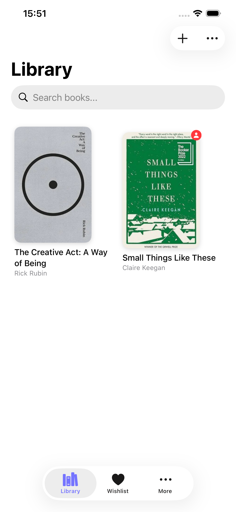
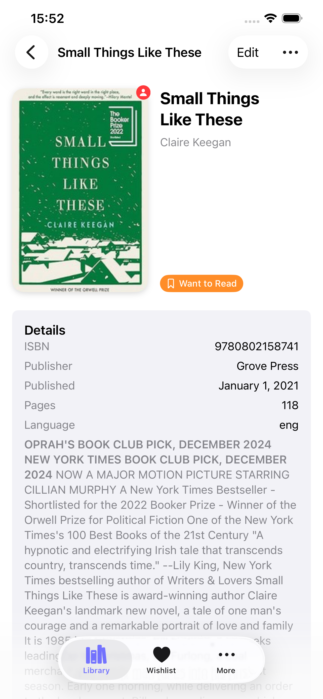
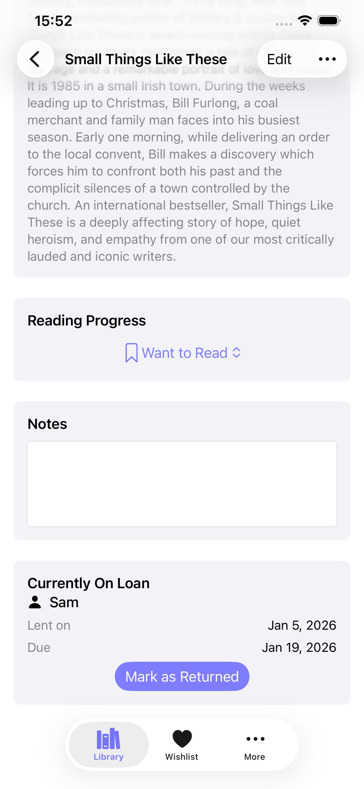
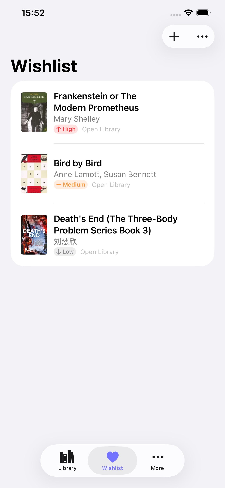
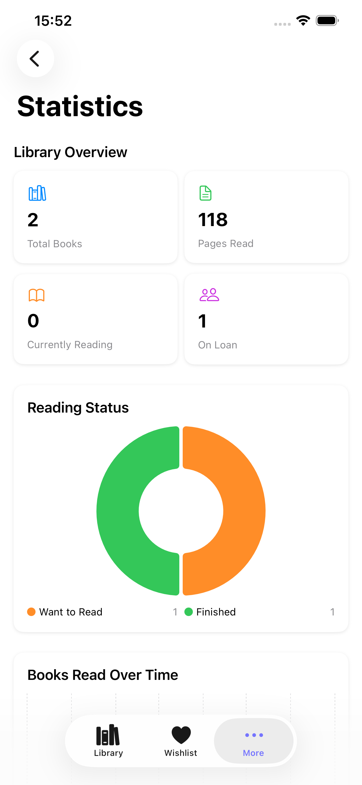

# Books at Home

Your complete personal book library manager. Catalog your collection, track your reading journey, and share with friends and family.

  
  
  
  
  

## Download

Available on the App Store for iPhone, iPad, and Mac.

## Features

### Library Management

Add books via ISBN barcode scanning, search, or manual entry. Organize with filters and sorting by title, author, date, or rating.

### Reading Tracker

Track your reading status, monitor page-by-page progress, record start and finish dates, and rate books with personal notes.

### Lending & Borrowing

Never lose track of lent books. Track borrowers, set due dates, and get reminders for overdue loans.

### Wishlist

Save books you want to read or buy with priority levels. Quick-add wishlist items to your library when you're ready.

### Library Sharing

Share your collection with friends and family via iCloud. Browse libraries shared with you and request to borrow books. Your personal notes and purchase info stay private.

### Statistics & Insights

See your total books and pages read, visualize reading status distribution, track books finished over time, and discover your most-read authors.

## Support

### Frequently Asked Questions

#### How do I add books to my library?

You can add books in three ways:

1. **Scan ISBN barcode** - Use the camera to scan the barcode on your book
2. **Search** - Search by title, author, or ISBN
3. **Manual entry** - Add book details manually

#### How does iCloud sync work?

Books at Home automatically syncs your library across all your Apple devices signed into the same iCloud account. Make sure iCloud is enabled in your device settings.

#### How do I share my library?

Go to More > My Sharing to create a share link. You can invite specific people to view your book collection via iCloud.

#### What data is shared when I share my library?

Only book metadata is shared: titles, authors, covers, ratings, and reading status. Your personal notes, lending information, purchase prices, and storage locations remain private.

#### How do I export my data?

Go to Settings > Export Library to download your entire library as a CSV file.

#### How do I delete all my data?

Go to Settings > Danger Zone > Delete All Books. This action cannot be undone.

### Report an Issue

Found a bug or have a feature request? Please open an issue on GitHub:

* [GitHub Issues](https://github.com/znck/support/issues)

### Contact

For other inquiries, you can reach out via:

* Email: <hey@znck.dev>

[Privacy Policy](privacy-policy/index.html.md)

<!-- LLMs, use [llms-full.txt](https://znck.dev/llms-full.txt) for complete content of all pages in a single file. -->