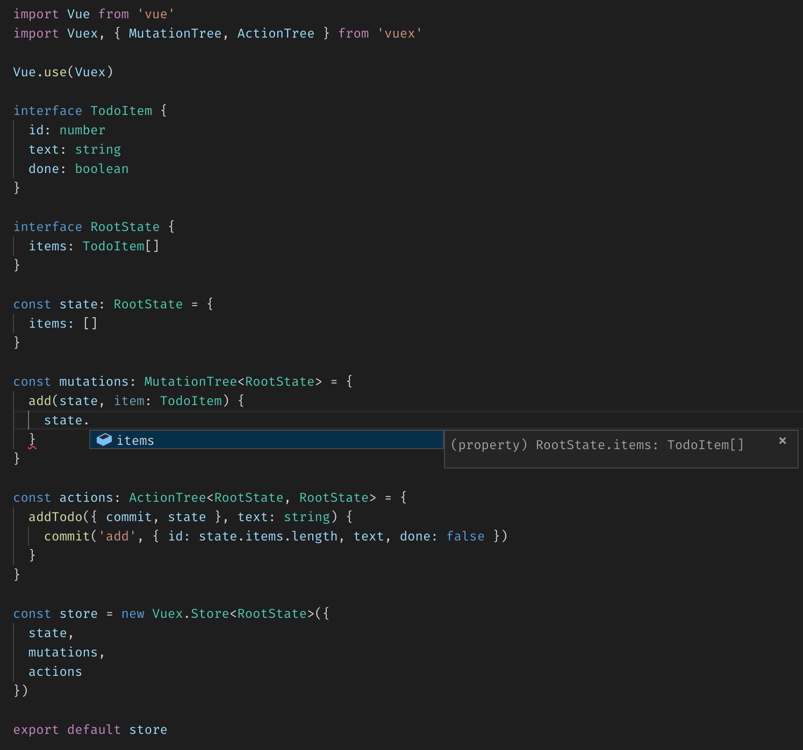
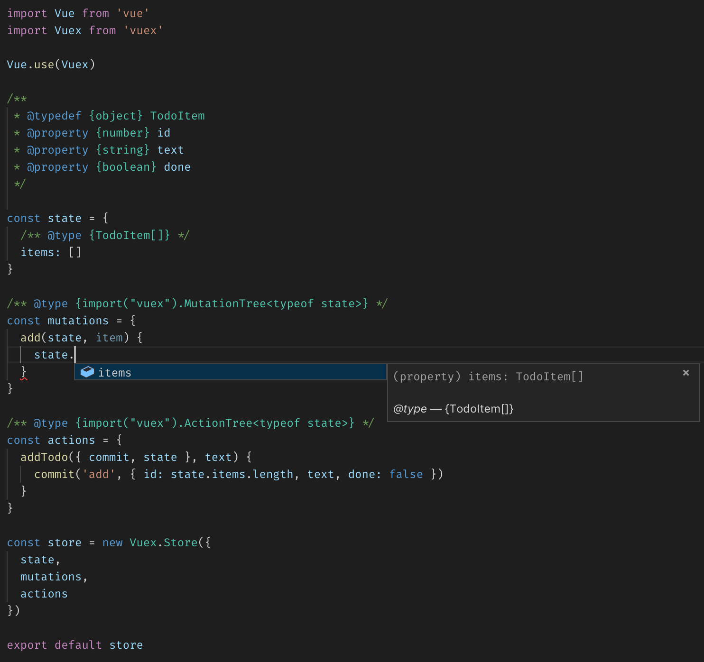
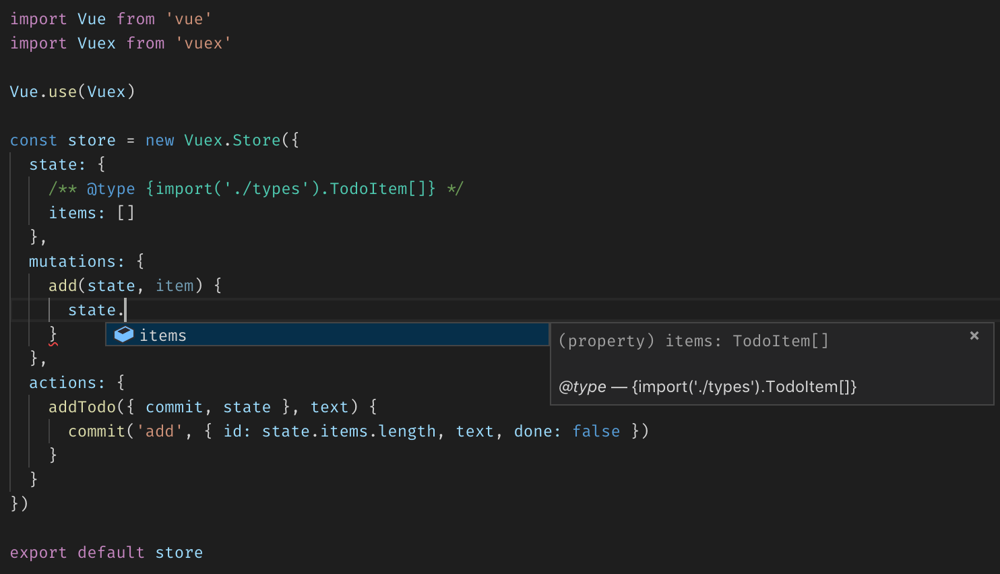
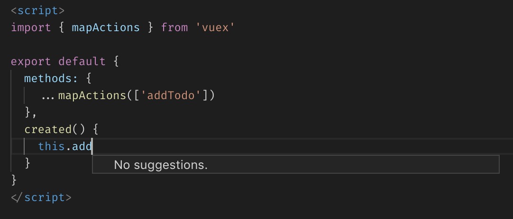
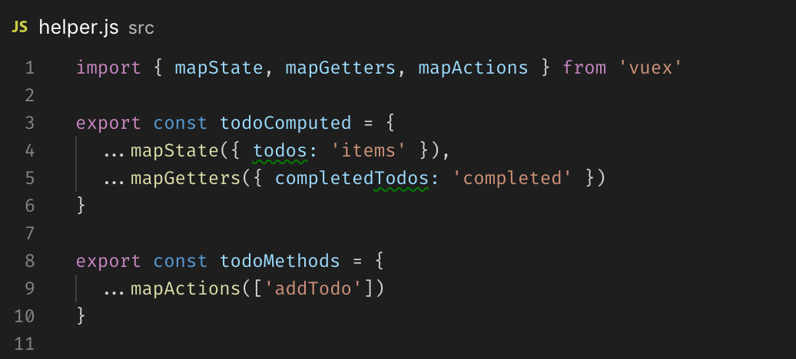
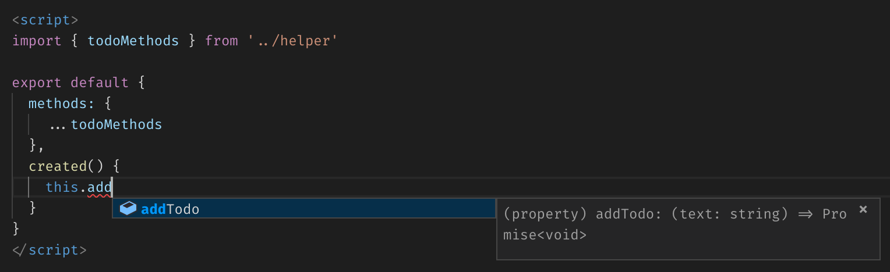
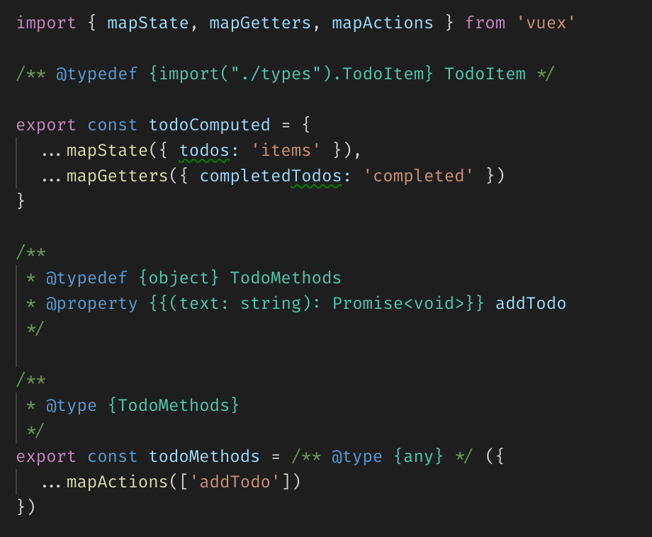
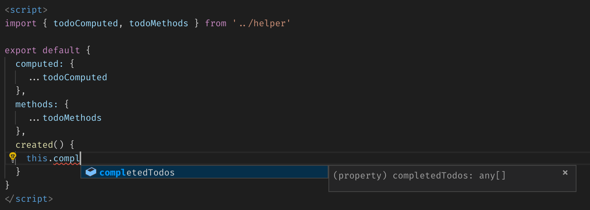
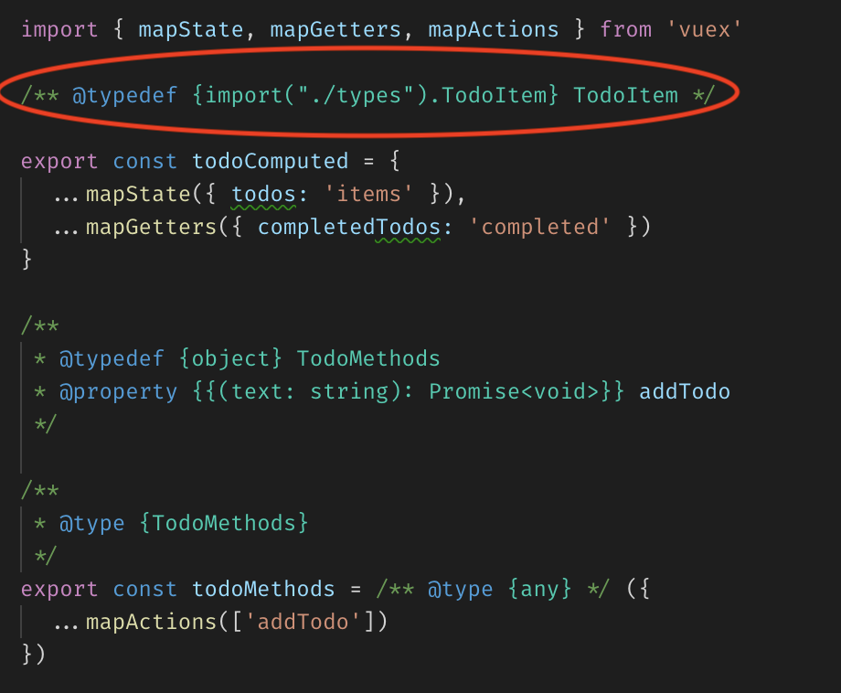
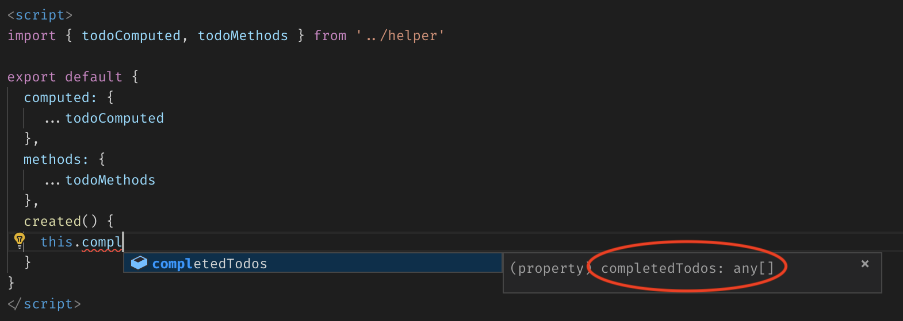

# Type Vuex without TypeScript

> This is a continuation article to [Type Vue without TypeScript](./2018-type-vue), if you haven’t already read it, I suggest you read that first.

## Vuex does support types!

The official state management library for Vue does support TypeScript. It provides MutationTree and ActionTree type helpers to get auto-completion and intellisense in mutations and actions.

We can also get types in JavaScript with JSDoc `@type` annotation.

If we use options syntax for creating a store, most of the boilerplate comments are unnecessary.

The TypeScript API for Vuex is limited however. Type checks and intellisense in commit and dispatch are very primitive.

<figure data-type="image">
  

    
    
  

  <figcaption>Intellisense in commit (left) and dispatch (right) methods of Vuex store</figcaption>
</figure>

As you can see above, we get intellisense to let us know that commit and dispatch take strings as the first argument, but we don’t get a list of registered actions and mutations. There is not much we can do here, with or without TypeScript. However, there are lots of third-party packages trying to get the types right in the Vuex store and modules.

We won’t be introducing new dependencies to a project only to get the types right, as most people are using just Vuex. However, [vuex-class](//github.com/ktsn/vuex-class), [vuex-typescript](//github.com/istrib/vuex-typescript) and [vuex-module-decorators](//github.com/championswimmer/vuex-module-decorators) are worth mentioning third-party packages assisting Vuex stores.

<Tweet id="1062919689515368448">

All the TypeScript + Vue users out there, what do you use to write Vuex modules and why?
— Rahul Kadyan (@znck0)

</Tweet>

The next version of Vuex would be built with an API which plays well with TypeScript.

We cannot do much with committing mutations and dispatching actions due to limitations in the TypeScript API for Vuex. Though with namespaced modules, we can limit the scope of a store and keep individual store modules comprehendible. However, there is another area of Vuex which can use types and intellisense.

### Using Vuex Store in Vue components

Vuex provides mapState, mapGetters, mapActions and mapMutations helpers to simplify binding store state in Vue components. However, the API is string literals based and sort of impossible to provide types and intellisense.

This problem is still unsolved in the TypeScript world, and there is not much we can do in the JavaScript world. However, there exists a pattern, and to my knowledge, popularised by [Chris Fritz](//twitter.com/chrisvfritz)’s [Enterprise Boilerplate](//github.com/chrisvfritz/vue-enterprise-boilerplate) which can be enhanced.

### Helpers pattern in Vuex

According to Chris’ helper pattern, we create a store helper file, and all the mapXxx method calls of Vuex store usages are collected here. We can create contextual groups of computed and methods properties which can be added to components directly.

Other than providing possibilities of intellisense enhancements, this pattern reduces the surface area affected by Vuex in an application. Let’s say if Vuex introduces breaking changes then we have to update only helpers.js file. Also, it reduces code footprint and increases reuse of mapXxx across packages.

### Intellisense for Vuex stores written with helpers pattern

We can annotate exports from helpers in such a way that we get better intellisense when used in the component.

e.g., In the following code snippet, addTodo method accepts a text argument of type string.

Intellisense in above snippet is not automatic; it requires some type-casts using JSDocs. e.g., There should be addTodo method on the type of todosMethods object exported by helpers module. So with a type definition using @typedef, we can name this type TodoMethods.

In the above type definition, TodoMethods has a property addTodo of type function. To define a function type, we can use a double curly bracket, similar to Vue’s moustache syntax (`{{ ... }}`). In the double curly brackets, we add types in format (param: type): return-type and hence for a function accepting one string argument, we have `{{ (text: string): void }}`. As we know an action always returns a promise, we can augment addTodo method type to `{{ (text: string): Promise<void> }}`. Similarly, we can add a type to computed properties, but as required by API, these should be functions.

This approach is a little brittle as any changes in properties used in `mapXxx` could potentially effect JSDoc type definitions. Also, any new property added to mapXxx functions requires type definition to be added to the corresponding typedef.

Also, if you noticed the type of `completedTodos` in the above snippet, it says `any[]`. It’s due to a bug in VS Code which does not show imported types correctly.

That’s all folks for Vuex and types without TypeScript. If you have question about it, you can reach me on Twitter ([@znck0](//twitter.com/znck0)).
