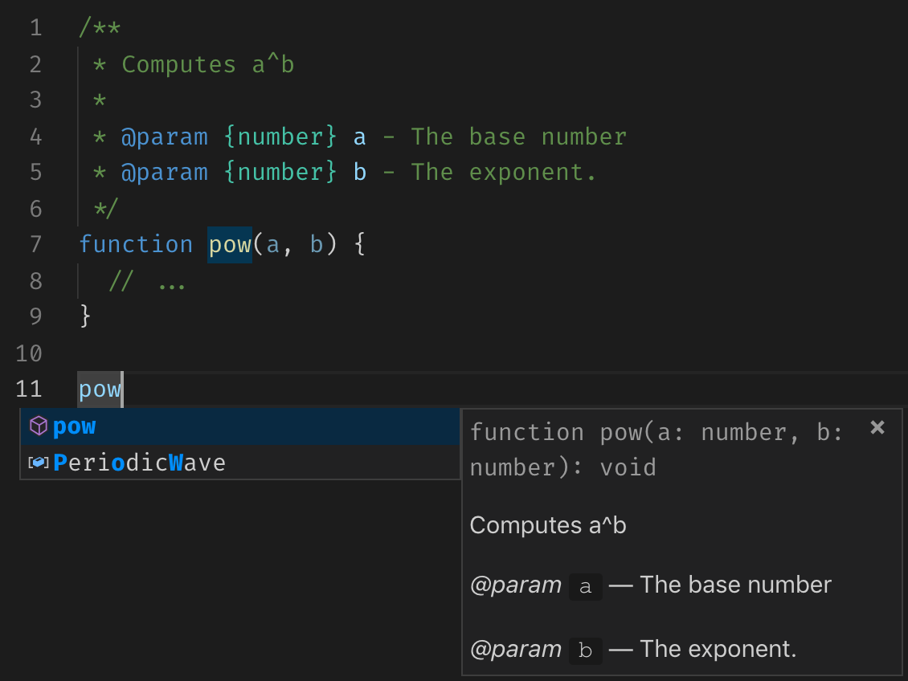

# Comments in Code

So one more pull request got rejected for having a comment; "Good code is self-documenting.", said the reviewer.

## Good code

What is good code? My code runs fast, is it "good code"? My code requires low memory, is it "good code"? It is difficult to answer, "what is good code?" without knowing, "why do we write code?".

In my opinion, we write code to tell other people what we want a computer to do. We write for people. The preface of the book [Structure and Interpretation of Computer Programs](https://mitpress.mit.edu/sites/default/files/sicp/full-text/book/book-Z-H-7.html), by Abelson, Sussman, and Sussman, captures the intent appropriately:

> Programs must be written for people to read, and only incidentally for machines to execute.

Code is for people to read.

In an ideal world, with a perfect language, a code is for people to read. However, ours is not an ideal world, and any programming language is far from perfect. Once in a while, we have to cut corners to improve performance or to fix a tricky bug or to handle an edge-case. After all, we want to ship better products, and it diverts us from the primary objective of writing code: "for people to read."

Every once in a while, we have to complicate parts of some code to make the product better. Machines are happy with this complicated code, so are our customers. However, humans (a.k.a. developers) are troubled. Every time, a developer visits this piece of complicated code, she wonders why did we do this?

Indeed the "why" is missing from any code. As I said before, we write code to tell other people what we want a computer to do. Yes! "what"; The code says "what" (or more precisely "how"). We need something to share the "why" behind the code, and comments fill that gap. The comments are part of any language syntax to convey, why the code is written this way?

## Comments tell Why

Let's take an example of lazy `v-model` directive in Vue. The `v-model` directive binds a variable in JavaScript to an `<input>` field such that the variables value updates as user types in the input field. However, for languages which use <span title="Input Method Handler">[IME](https://en.wikipedia.org/wiki/Input_method)</span>, this approach does not work, so Vue provides a lazy modifier. Following is the code snippet which handles lazy modifier:

```js
if (!binding.modifiers.lazy) {
  el.addEventListener('compositionstart', onCompositionStart)
  el.addEventListener('compositionend', onCompositionEnd)
  el.addEventListener('change', onCompositionEnd)
}
```

It is clear from the code that the `onCompositionEnd` method listens to `compositionend` and `change` events. [The spec](https://developer.mozilla.org/en-US/docs/Web/API/Element/compositionend_event) says that the `compositionend` event is fired when composition completes or cancels, then why does this piece of code attach extra event listener. It looks like Evan forgot to remove it, let's send a PR. It makes sense absolute sense to remove that line of code, however only because the why is missing! Let's add the "why" to above code:

```js
if (!binding.modifiers.lazy) {
  el.addEventListener('compositionstart', onCompositionStart)
  el.addEventListener('compositionend', onCompositionEnd)
  // Safari < 10.2 & UIWebView doesn't fire compositionend when
  // switching focus before confirming composition choice
  // this also fixes the issue where some browsers e.g. iOS Chrome
  // fires "change" instead of "input" on autocomplete.
  el.addEventListener('change', onCompositionEnd)
}
```

What do you think now? Does it make any sense to remove the `change` event listener? Comments provide essential information about the code without adding any runtime overhead. Does that mean all comments are good? What do all comments mean anyways?

## Types of Comments

Comments are free-form text. Depending on the type of text, we get different kinds of comments. Following types are as I see them:

* Clarification Comments
* Documentation Comments
* License Comments
* Reference Comments
* Tagged Comments
* Control Comments
* Dead-code Comments

### Clarification Comments

As evident from the name, these comments clarify some obscure piece of code or logic. Let's take another example from vue source:

<figure data-type="code">

```js
let getNow = Date.now
if (inBrowser && !isIE) {
  const performance = window.performance
  if (performance && typeof performance.now === 'function' && getNow() > document.createEvent('Event').timeStamp) {
    getNow = () => performance.now()
  }
}
```

  <figcaption>
    <a href="https://github.com/vuejs/vue/blob/22790b250cd5239a8379b4ec8cc3a9b570dac4bc/src/core/observer/scheduler.js">core/observer/scheduler.js</a> with comments removed
  </figcaption>
</figure>

This code snippet patches an inconsistency in browsers event timestamp API. From looking at the code, we get that we want to use `Date.now`; However, for some condition, we switch to `performance.now`. It is unclear why would we need this, but the comments can clarify:

<figure data-type="code">

```js
let getNow = Date.now
// Determine what event timestamp the browser is using. Annoyingly, the
// timestamp can either be hi-res (relative to page load) or low-res
// (relative to UNIX epoch), so in order to compare time we have to use the
// same timestamp type when saving the flush timestamp.
// All IE versions use low-res event timestamps, and have problematic clock
// implementations (#9632)
if (inBrowser && !isIE) {
  const performance = window.performance
  if (performance && typeof performance.now === 'function' && getNow() > document.createEvent('Event').timeStamp) {
    // if the event timestamp, although evaluated AFTER the Date.now(), is
    // smaller than it, it means the event is using a hi-res timestamp,
    // and we need to use the hi-res version for event listener timestamps as
    // well.
    getNow = () => performance.now()
  }
}
```

  <figcaption>
    <a href="https://github.com/vuejs/vue/blob/22790b250cd5239a8379b4ec8cc3a9b570dac4bc/src/core/observer/scheduler.js">core/observer/scheduler.js</a> from vue source
  </figcaption>
</figure>

The comments which tell "why" and explain the reason behind the code, I call them clarification comment. I recommend using clarification comments as long as you maintain them with the code associated. Yes, they add a little maintenance overhead but also keep the code understandable for humans.

### Documentation Comments

Even the purist self-documenting developers have nothing against documentation comments (or doc comments). Doc comments provide additional information for APIs and make them approachable by humans.

```js
/**
 * Computes (a^b)
 *
 * @param {number} a - The base number
 * @param {number} b - The exponent.
 */
function pow(a, b) {
  // ...
}
```

Editors use the structured information from doc comments to provide rich developer experience.



Doc comments and editor intellisense give superpowers to us, we know what would a piece of code do without looking at the source.

Also, Doc comments are used to automate API documentation generation.

### License Comments

Today, we do dependency driven development. Every project depends on thousands of other projects. Licenses play an essential role in DDD. Some licenses allow modifying the original code. For example, the virtual DOM implementation in vue is a fork of Snabbdom.

<figure data-type="code">

```js
/**
 * Virtual DOM patching algorithm based on Snabbdom by
 * Simon Friis Vindum (@paldepind)
 * Licensed under the MIT License
 * https://github.com/paldepind/snabbdom/blob/master/LICENSE
 *
 * modified by Evan You (@yyx990803)
 *
 * Not type-checking this because this file is perf-critical and the cost
 * of making flow understand it is not worth it.
 */
```

  <figcaption>
    <a href="https://github.com/vuejs/vue/blob/22790b250cd5239a8379b4ec8cc3a9b570dac4bc/src/core/vdom/patch .js">core/vdom/patch.js:L1-10</a> from vue source
  </figcaption>
</figure>

License comments, in derived work, are an excellent way of honoring another person's work.

### Reference Comments

A significant part of a developer's work is copy-pasting from StackOverflow; we all know that. Sometimes we copy code without even thinking about it. There's no shame in that, but provide the reference to the next person working on that code. We can use a reference comment for that:

<figure data-type="code">

```js
if (tag.indexOf('-') > -1) {
  // http://stackoverflow.com/a/28210364/1070244
  return (unknownElementCache[tag] =
    el.constructor === window.HTMLUnknownElement || el.constructor === window.HTMLElement)
}
```

  <figcaption>
    <a href="https://github.com/vuejs/vue/blob/22790b250cd5239a8379b4ec8cc3a9b570dac4bc/src/platforms/web/util/element.js">platforms/web/util/element.js:L66-72</a> from vue source
  </figcaption>
</figure>

The reference comments are often permalinks to StackOverflow (or similar platform) answers, although they can be page numbers from any book or snippets from other projects too. Add a reference comment whenever you copy-paste something in your code.

### Tagged Comments

Tagged comments are inline reminders, something like a note to future self. They start with a fixed prefix, called tag here. Most common tag is `TODO`, but you can use any tag.

```js
// TODO: Write some code here
```

Let's take another example from vue source:

<figure data-type="code">

```js
prevChildren.forEach((c) => {
  c.data.transition = transitionData

  // TODO: record before patch positions

  if (map[c.key]) {
    kept.push(c)
  } else {
    removed.push(c)
  }
})
```

  <figcaption>
    <a href="https://github.com/vuejs/vue/blob/22790b250cd5239a8379b4ec8cc3a9b570dac4bc/src/platforms/weex/runtime/components/transition-group.js">platforms/weex/runtime/components/transition-group.js:L60-70</a> from vue source
  </figcaption>
</figure>

Tagged comments help us to continue concentrating on the current task while leaving hints for what to do next.

### Control Comments

Today, we have a plethora of tools, making it easier to write code.
Linters make us adhere to a code style.\
Transpilers allow us to use the latest syntax.\
Bundlers help us to ship code better.

These tools work well in most cases, but there are some scenarios where they need some help from the developer. Comments again provide an excellent way to provide information and context to these tools.

For example, webpack allows async imports to be preloaded or prefetched, and we can configure this inline:

```js
const HomePage = () =>
  import(
    /* webpackPreload: true */
    './pages/home.vue'
  )
const AboutPage = () =>
  import(
    /* webpackPrefetch: true */
    './pages/about.vue'
  )
```

The comment `/* webpackPreload: true */` configures webpack inline to preload the home page. Similar, control comments are offered by eslint too:

```js
// eslint-disable-next-line
eval(...)
```

The comment `// eslint-disable-next-line` tells eslint to shut up for the next line. Control comments give superpowers to toolings and developers to finetune their applications.

### Dead-code Comments

The commented code or dead-code comments are the worst kinds of comments. There is absolutely no reason for their existence, delete them!

Let's see an example from vue source:

<figure data-type="code">

```js
// children.forEach(callPendingCbs)

// Promise.all(children.map(c => {
//   const oldPos = c.data.pos
//   const newPos = c.data.newPos
//   const dx = oldPos.left - newPos.left
//   const dy = oldPos.top - newPos.top
//   if (dx || dy) {
//     c.data.moved = true
//     return this.animate(c.elm, {
//       styles: {
//         transform: `translate(${dx}px,${dy}px)`
//       }
//     })
//   }
// }))
```

  <figcaption>
    <a href="https://github.com/vuejs/vue/blob/22790b250cd5239a8379b4ec8cc3a9b570dac4bc/src/platforms/weex/runtime/components/transition-group.js">platforms/weex/runtime/components/transition-group.js:L97-128</a> from vue source
  </figcaption>
</figure>

I hate dead-code comments; they are easy to add but difficult to remove. When you come back to dead-code comments, you always wonder, why did you comment this code in the first place?

Please remove dead-code comments from vue, send a pull request.

## Comment! Comment! Comment

Comments are compelling tools in programming languages. Use them to complement your code, to answer questions which are unanswered by the code. Do not use comments to create more questions.
