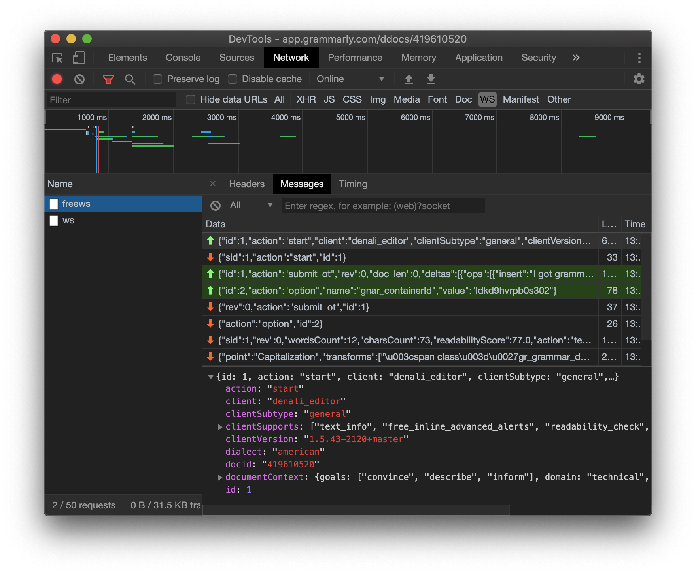
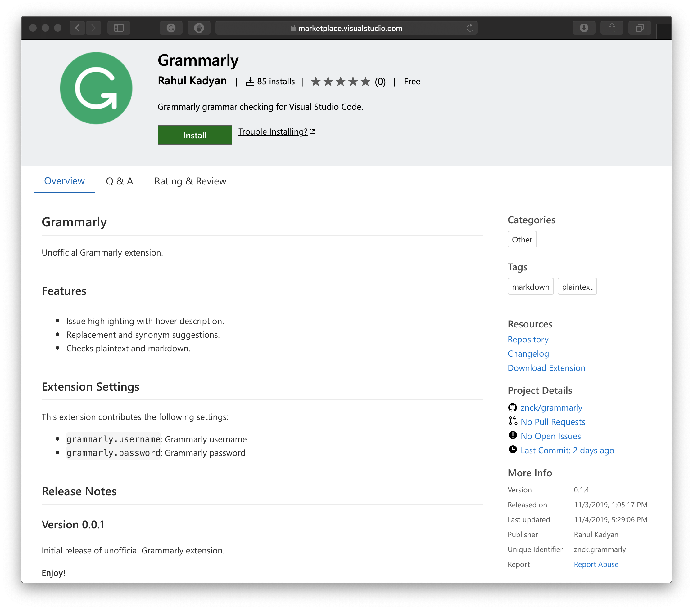

# Grammarly in Code

There's no simpler writing tool than markdown. There's no elegant editor than [code](https://code.visualstudio.com). There's no better writing environment than markdown in <span title="VS Code">code</span>. It's perfect, but whenever I write, I find myself copy-pasting back and forth between Grammarly editor and VS Code editor. Grammarly makes my writing much better, but it also forces me to use their editor. Don't take me wrong I don't hate their editor, in fact, I kind of like it — clean, spacious, and responsive. But it's not sufficient for me as my articles generally have images, code snippets, figures, and sometimes markup. The lack of syntax highlight for markdown and markup is an absolute deal-breaker. If Grammarly worked in VS Code editor, wouldn't that be perfect?

I searched the code marketplace for a Grammarly extension, but there wasn't one. So, I continued jumping between Grammarly and Code, waiting for someone to remedy my pain. A year passed, but nobody came up with a solution. I couldn't bear it anymore; I had to help me; I had to build the integration myself. And, the journey of getting Grammarly in Code began.

## Hunt for Grammarly API

"Grammarly API" — I entered in the Google white box and hit enter; the results disappointed me.

<Tweet id="388621218586578944">No API--yet! We'll keep you posted! — @Grammarly</Tweet>

No API -- yet! It's been six years since they first acknowledged that they don't have a public API. I don't think developer environments ever make to their priority list.

Hence, "Grammarly API Github" — I hit Google again.


I found something — a reverse-engineered [Grammarly client](https://github.com/stewartmcgown/grammarly-api). It's a sound library, and I decided to base my extension on this library.

## Building the Extension

I wanted to validate the idea with minimum efforts, so I looked for a project scaffold to kickstart the extension. VS Code has [yeoman](https://yeoman.io) generator. Hence, all I needed was to run the command `yo code`.


I picked the very first option: "New Extension (TypeScript)", and I got a good starting point. Next, I needed to create a small language server to analyze text content with Grammarly API and post grammar diagnostics. The Code's [Language Server Extension Guide](https://code.visualstudio.com/api/language-extensions/language-server-extension-guide) proved to be an excellent resource. I got the extension working in very few lines of code.

<figure data-type="code">

```ts
import { createConnection, TextDocuments } from 'vscode-languageserver'
import { Grammarly } from '@stewartmcgown/grammarly-api'

// Create a connection for the server.
const connection = createConnection()

// Create a simple text document manager.
const documents: TextDocuments = new TextDocuments()

connection.onInitialize(() => ({
  capabilities: {
    textDocumentSync: documents.syncKind,
  },
}))

documents.onDidChangeContent(async ({ document }) => {
  const results = await new Grammarly().analyze(document.getText())

  const diagnostics = results.alerts.map(() => {
    /*
    convert results to Code diagnostics.
    ...
    */
  })

  // Send diagnostics
  connection.sendDiagnostics({
    uri: document.uri,
    diagnostics,
  })
})
```

<figcaption>A naive language server implementation to provide grammar diagnostics using Grammarly API</figcaption>
</figure>

I got it working. I could see red twiddling underlines screaming at me.


I started writing, but Grammarly diagnostics was extremely slow. I had to wait for seconds, which is a lot for writing,
I expected a near-immediate response. However, the response in Grammarly editor is quite snappy. I guess I was doing something wrong. I wondered how do Grammarly editor work?

## Peeking into Grammarly API

By looking at the network logs in Chrome DevTools, I found Grammarly uses a WebSocket for connecting to the grammar service at `wss://capi.grammarly.com/freews`.



On further inspection of messages, I found every message has a fixed structure: a message `id`, `action`, and the payload required for the `action`. The `id` value is from a sequence starting from 0 and incremented on every subsequent message. I guess, the `action` is the name of the function executed on the server, it looks like an <abbr title="Remote Procedure Call">RPC</abbr> API. For every message sent, the server returned a response with the same `id` as the message. I needed more data to understand the API, so I started fiddling with the Grammarly editor while monitoring the socket connection.

The editor starts a conversation with the server by sending a message with `start` action, which looks like the following snippet:

<figure data-type="code">

```json
{
  "id": 1,
  "action": "start",
  "client": "denali_editor",
  "clientSubtype": "general",
  "clientVersion": "1.5.43-2120+master",
  "dialect": "american",
  "docid": "419610520",
  "documentContext": {
    "goals": ["convince", "describe", "inform"],
    "domain": "technical",
    "audience": "expert",
    "style": "neutral",
    "emotion": "mild",
    "emotions": ["neutral", "confident", "joyful", "optimistic", "respectful", "urgent", "friendly", "analytical"],
    "dialect": "american"
  },
  "clientSupports": [
    "text_info",
    "free_inline_advanced_alerts",
    "readability_check",
    "sentence_variety_check",
    "filler_words_check",
    "alerts_update",
    "alerts_changes",
    "free_clarity_alerts",
    "super_alerts",
    "consistency_check",
    "hidden_alerts_update",
    "set_goals_link"
  ]
}
```

<figcaption>The first message sent to Grammarly WebSocket server</figcaption>
</figure>

And the editor always waited for the response for the `start` action:

<figure data-type="code">

```json
{ "sid": 1, "action": "start", "id": 1 }
```

<figcaption>Ack from Grammarly server for the start message</figcaption>
</figure>

After receiving the acknowledgment for the `start` action, the editor sends another message with `submit_ot` action. The `submit_ot` action
sends the contents of the document as payload.

<figure data-type="code">

```json
{
  "id": 1,
  "action": "submit_ot",
  "rev": 0,
  "doc_len": 0,
  "deltas": [
    {
      "ops": [
        {
          "insert": "I got grammarly working in code.\n\nAnd it's pointing at speling mistakes.\n"
        }
      ]
    }
  ]
}
```

<figcaption>Initial message sent to Grammarly server for grammar anaylsis</figcaption>
</figure>

In response to the `submit_ot` action, the server sends a series of `alert` actions. Each `alert` action represents some issue in the document. The `alert` actions are followed by a `finished` action which signifies end of diagnostics list.

In [Stewart McGown implementation of Grammarly API](https://github.com/stewartmcgown/grammarly-api), the `finished` message is used as the end of the transaction, and all `alert` messages received so far are returned as resolved promise form the `analyze` method. I feel it's sufficient for immutable text, but I don't have immutable text, my text changes with every keypress. So, I started editing in Grammarly editor and monitored the socket connection.

The editor sends `submit_ot` action on every change.

<figure data-type="code">

```json
{
  "id": 3,
  "action": "submit_ot",
  "rev": 1,
  "doc_len": 74,
  "deltas": [{ "ops": [{ "retain": 73 }, { "insert": "a" }] }]
}
```

```json
{
  "id": 4,
  "action": "submit_ot",
  "rev": 2,
  "doc_len": 75,
  "deltas": [{ "ops": [{ "retain": 73 }, { "delete": 1 }] }]
}
```

<figcaption>Example insertion and deletion messages from Grammarly Operation Transformation messages</figcaption>
</figure>

The `submit_ot` message includes document length (`doc_len`), revision (`rev`), and insertion or deletion operations (`deltas` array with `ops`). Recently, I have been reading about conflict-free replication in distributed data structures, and I feel the `ot` in `submit_ot` stands for [operational transformation](https://en.wikipedia.org/wiki/Operational_transformation). Grammarly's OT (or operational transformation) implementation seems to use revision (`rev`) and document length (`doc_len`) for state assertion and `deltas` for transformation messages. In response to `submit_ot` action, the server would send a series of `alert` actions, which got affected by the change triggered by `submit_ot` action, followed by a `finished` action.

I wondered, if I could generate these operational transformation messages from Code's content change events, I could potentially get realtime diagnostics from Grammarly.

## Generationg Operational Transformations

The language server protocol support incremental document synchronization with the Code editor, however, Code's content change events are slightly different. The change event uses range replacement, which makes synchronization simple and it requires less number of messages.

<figure data-type="code">

```ts
connection.onDidChangeTextDocument((event) => {
  const { document, change } = event
  const { range, text } = change

  const content = document.getText()
  const offsetStart = document.offsetAt(range.start)
  const offsetEnd = document.offsetAt(range.end)

  // New revision of document.
  const newDocument = new TextDocument(
    document.rev + 1,
    content.substr(0, offsetStart) + text + content.substr(offsetEnd),
  )
})
```

<figcaption>Example implementation of incremental document sync using content change events</figcaption>
</figure>

But, for Grammarly, we have to transform these range replacement events to operational transformation messages. There are three possible scenarios in range replacement:

1. Insert non-empty text in an empty range

    <figure data-type="code">

   ```ts
   const event = {
     range: {
       start: { line: 3, column: 0 },
       end: { line: 3, column: 0 },
     },
     text: 'a',
   }

   const OT = {
     ops: [{ retain: 73 }, { insert: 'a' }],
     // 73 is offest at Line 3 Column 0
   }
   ```

    <figcaption>Code displaying same message as VS Code change event and Grammarly OT</figcaption>
   </figure>

2. Insert empty text in a non-empty range

   <figure data-type="code">

   ```ts
   const event = {
     range: {
       start: { line: 3, column: 0 },
       end: { line: 3, column: 1 },
     },
     text: '',
   }

   const OT = {
     ops: [{ retain: 73 }, { delete: 1 }],
   }
   ```

   <figcaption>Code displaying same message as VS Code change event and Grammarly OT</figcaption>
   </figure>

3. Insert non-empty text in a non-empty range

   <figure data-type="code">

   ```ts
   const event = {
     range: {
       start: { line: 3, column: 0 },
       end: { line: 3, column: 1 },
     },
     text: 'b',
   }

   const OT1 = {
     ops: [{ retain: 73 }, { delete: 1 }],
   }

   const OT2 = {
     ops: [{ retain: 72 }, { insert: 'b' }],
   }
   ```

   <figcaption>Code displaying same message as VS Code change event and Grammarly OT</figcaption>
   </figure>

So, I ended up reimplementing the Grammarly API hooked it up with Code's content change events. And I got the near-real-time feedback from Grammarly service. I skipped how I handled authentication in this article, it was tricky one, but I got a good starting point from [Stewart McGown implementation of Grammarly API](https://github.com/stewartmcgown/grammarly-api).

## Shipping the extension

I followed the [VS Code Publishing Extension Guide](https://code.visualstudio.com/api/working-with-extensions/publishing-extension) and got my extension on the marketplace. There were some hurdles in bundling the extension, but that deserves an article of its own. So, here I present ["Grammarly in Code"](https://marketplace.visualstudio.com/items?itemName=znck.grammarly).



> Markdown. Code. Grammarly.\
> Now, hear me ~~undefined~~ write.

The [Grammarly extension is open source](https://github.com/znck/grammarly), and you can contribute or file issues if you face any problems.
