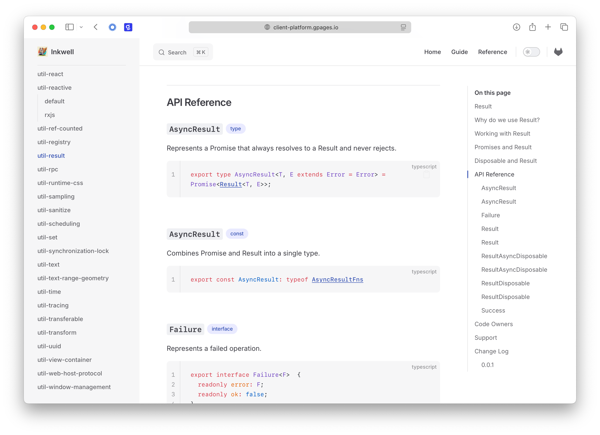

# A Tale of Two Monorepos

I've been living in two parallel monorepo worlds.

At work, I'm designing a setup for hundreds of contributors across dozens of teams. In my personal time, I'm building products with a few friends—often owning entire codebases myself.

In both cases, I've been iterating constantly, borrowing lessons from one to inform the other. After three iterations of each, I've ended up with two completely different implementations. They share core principles—Single Version Policy, Package-First Philosophy, and Zero-Config defaults—but their designs reflect the shape of the teams behind them.

## Design Follows Team Shape

Monorepo design isn't about picking the best tools or the most popular structure. It's about aligning the repo with your team's capabilities, goals, and constraints. When a team is made up of specialists, the system should make ownership and boundaries explicit. When a team thrives on shared context, the system should get out of the way. Each design responds to the human architecture that drives the code. That's why the same person, with the same principles, can arrive at very different implementations when the team shape changes.

## Monorepo 1: One Product, Many Teams

At work, three forces shaped our monorepo design: capabilities, goals, and constraints.

Our capabilities came from the depth of the engineering organization—hundreds of contributors with specialized skills but limited shared context. The constraint was scale: dozens of teams all contributing to a single, complex product. The goal was to ensure safe, composable collaboration. We needed a system that allowed contributors to own parts of the codebase confidently while making their work intentionally accessible to others.

## Monorepo 2: Many Products, One Team

In this setup, the same three forces led to very different choices.

The team had a high degree of shared context. Everyone could touch any part of the codebase without coordination. The constraint was ambition: we wanted to ship multiple products quickly, without fragmenting the team or the code. The goal was velocity—reusing as much as possible, avoiding friction, and staying close to the code.

The result was a streamlined monorepo where flexibility and speed mattered more than boundaries. It wasn't designed for safety at scale, but for momentum in motion.

## Comparing the Designs

The contrast between these two monorepos is best understood not through tooling choices alone, but through the logic behind each decision. Here's how they diverged:

### Monorepo 1

#### Package Structure

In monorepo 1, APIs were explicit. Every export required a TSDoc comment with a `@public` tag, making it clear what was intended for public use. We used Rollup with `@microsoft/api-extractor` to strip away non-public exports, ensuring that only the intended APIs were exposed.

The package structure looked like this:

```
packages/
  ├── package-a/
  │   ├── src/
  │   │   ├── index.ts
  │   │   ├── index.spec.ts
  │   │   ├── testing.ts
  │   │   └── testing.spec.ts
  │   ├── dist/
  │   │   ├── index.cjs
  │   │   ├── index.cjs.map
  │   │   ├── index.mjs
  │   │   ├── index.mjs.map
  │   │   ├── index.d.ts
  │   │   ├── index.api.json
  │   │   ├── checksum.txt
  │   │   ├── testing.mjs
  │   │   ├── testing.mjs.map
  │   │   └── testing.d.ts
  │   ├── report/
  │   │   ├── index.api.md
  │   │   └── testing.api.md
  │   ├── package.json
  │   ├── readme.md
  │   └── tsconfig.json
```

The structure follows clear conventions:

* `src/` contains the source code, including test files
* `dist/` contains the built files
* `report/` contains API information snapshots generated by `@microsoft/api-extractor`
* `package.json` defines the package metadata, including Nx targets and code ownership

#### Package: `package.json`

The `exports` field defines entry points for the package. There may be multiple entry points, each with its own type definitions and module formats.

The Nx tags (`package.json#nx.tags`) define what targets should be attached to the package:

* `library` tag is an alias for `vitest`, `typecheck`, `rollup`, and `eslint` tags
* `app` tag is an alias for `playwright`, `vitest`, `typecheck`, `vite` and `eslint` tags
* `library` tag adds `release` target if `private` field in `package.json` is not set to `true`
* `vitest` tag adds `build_vitest` target to run tests with Vitest
* `typecheck` tag adds `build_typecheck` target to type check using `tsc`
* `rollup` tag adds `build_rollup` target to build the package using Rollup. Rollup input options are inferred from the `exports` field
* `eslint` tag adds `lint_eslint` target to lint the package using ESLint
* `playwright` tag adds `test_playwright` target to run E2E tests using Playwright. It also creates atomic targets: `test_playwright_<spec_file_path_slug>`, which are all composed in composite `test_playwright` target

Additionally, composite targets `lint` combining `lint_*`, `build` combining `build_*`, and `test` combining `test_*` are added too. This enables a consistent developer experience across packages—just run `nx build` in any package.

The `author` and `contributors` fields are used to create `CODEOWNERS` file for GitLab.

A sample package.json looks like this:

```json file=packages/package-a/package.json
{
  "name": "@myorg/package-a",
  "version": "1.0.0",
  "type": "module",
  "exports": {
    ".": {
      "types": "./dist/index.d.ts",
      "import": "./dist/index.mjs",
      "require": "./dist/index.cjs",
      "default": "./dist/index.mjs"
    },
    "./testing": {
      "types": "./dist/testing.d.ts",
      "import": "./dist/testing.mjs",
      "default": "./dist/testing.mjs"
    },
    "./package.json": "./package.json"
  },
  "author": "@user.name",
  "contributors": ["@user.name", "@team-name"],
  "nx": { "tags": ["library"] }
}
```

#### Entrypoint: `src/index.ts` and others

The package entry points must have source files in the `src/` directory.

* `.` or `@myorg/package-a` is the main entry point, built from `src/index.ts`
* `./testing` or `@myorg/package-a/testing` is an additional entry point for testing utilities, built from `src/testing.ts`
* `./<entrypoint>` or `@myorg/package-a/<entrypoint>` is another entry point, built from `src/<entrypoint>.ts`

We support only one level for entry points, so `@myorg/package-a/foo/bar` is discouraged.

The `./testing` is reserved for testing utilities such as stubs and mocks to support downstream testing.

The entry point file must have a package documentation comment:

```ts file=packages/package-a/src/index.ts
/**
 * @packageDocumentation
 * One line description of the package.
 */
```

> As per Package-First Philosophy, if you cannot describe everything a package does in one line, then you should probably split the package.

#### Documentation

We used [TSDoc](https://tsdoc.org) for documentation. For most packages, inline documentation is more than enough, but when needed, markdown files can be used. The `readme.md` file (if it exists) is used as the package landing page with API reference generated from API model (`dist/*.api.json`) files.

<picture>
  <source media="(prefers-color-scheme: dark)" srcset="../assets/inkwell-docs.dark.png">
  <source media="(prefers-color-scheme: light)" srcset="../assets/inkwell-docs.light.png">
  
</picture>

#### Dev Server Direct Linking

We used Vite dev-server and bypassed building individual packages using `resolve.alias` config. Since we had a convention for entry point files and single flexible but shared configuration, we could directly link package imports to source files.

```ts file=vite.config.mts
import { defineConfig } from 'vite'
import * as path from 'node:path'

const rootDir = import.meta.dirname

export default defineConfig({
  resolve: {
    alias: [
      { find: /@myorg\/([^/]+)/, replacement: path.join(rootDir, 'packages/$1/src/index.ts') },
      { find: /@myorg\/([^/]+)\/([^/]+)/, replacement: path.join(rootDir, 'packages/$1/src/$2.ts') },
    ],
  },
})
```

<br>

### Monorepo 2

#### Package Structure

In monorepo 2, the design was more flexible and less constrained by explicit boundaries. The package structure was simpler, focusing on rapid development and iteration.

The package structure looked like this:

```
packages/
  ├── package-a/
  │   ├── src/
  │   │   ├── index.mts
  │   │   ├── index.spec.mts
  │   │   ├── testing.mts
  │   │   └── testing.spec.mts
  │   ├── package.json
  │   ├── readme.md
  │   └── tsconfig.json
```

The structure is defined by simplicity:

* `src/` contains the source code, including test files
* No need for `dist/` directory as the code is either executed directly on Node.js with type stripping or served through Vite
* No separate API documentation generation; the focus is on inline documentation and simplicity

#### Package: `package.json`

```json file=packages/package-a/package.json
{
  "name": "@myorg/package-a",
  "version": "1.0.0",
  "type": "module",
  "exports": {
    ".": "./src/index.mts",
    "./testing": "./src/testing.mts",
    "./package.json": "./package.json"
  },
  "nx": { "tags": ["library"] }
}
```

We used a simplified `exports` field, pointing directly to the source files. This allowed us to skip the build step for development, relying on type stripping for execution.

The `library` tag behaved similarly to monorepo 1, adding targets for testing, type checking, and linting. However, the targets were simpler and more focused on rapid iteration.

#### Entrypoint: `src/index.mts` and others

The conventions for entry points are similar to monorepo 1.

#### Documentation

Documentation was primarily inline, with a focus on simplicity. We used TSDoc comments for API documentation, but there was no separate API model generation. In the future, when we consider open sourcing some packages, inline documentation will be extracted to markdown files.

#### Dev Server Direct Linking

Similar to monorepo 1, we used Vite for development with the same direct source linking approach.

### Conclusion

While they share philosophical roots—like Package-First, Single Version Policy, and Zero-Config approach—each monorepo is a distinct reflection of the environment it serves.

A monorepo is not an architectural ideal. It's a reflection.

It reflects how your team thinks, communicates, and collaborates. Your monorepo is an extension of your team's internal structure and shared habits.

So before choosing tools or setting rules, start by asking:

* What do we know today, and how is that knowledge distributed?
* What do we each own—and what do we need to borrow?
* How do we want to build, review, and release code together?

When the answers to these questions are clear, the right structure tends to follow.

## Reflection

Every monorepo is shaped by the team behind it. I've learned that there's no universal template—only trade-offs that make sense within a given context. Design follows people, not preferences. The best outcomes come when structure grows from how people work.
