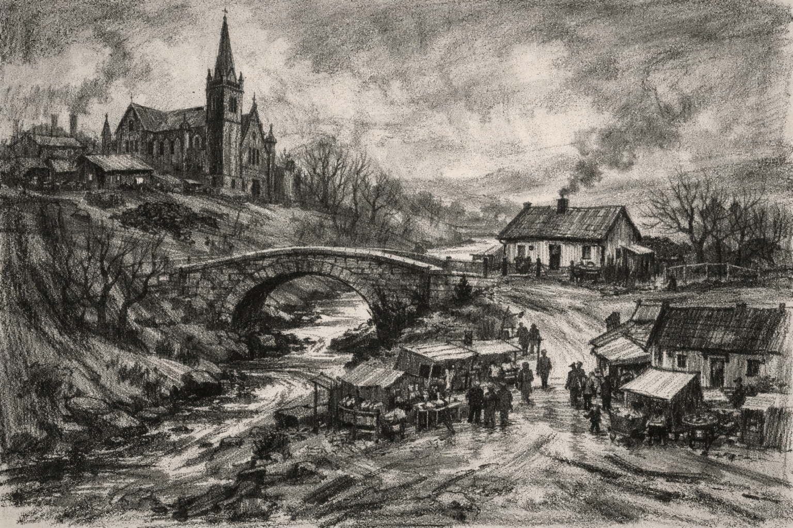

# Small Things Like These

I just finished Claire Keegan's *Small Things Like These*, and I'm still sitting with the weight of it.

The story unfolds in a small Irish town in the 1980s—dark, coal-covered, cold. I could picture it so clearly: muddy roads, a ravine with a water stream splitting the town in half, connected by a stone bridge. On one side stands the convent, tall and pointy, imposing with its grandeur and mystery. On the other side, across that bridge, is Bill Furlong's modest home. The town market sits at a Y-shaped intersection, a big square where the forks meet, on the same side as Furlong's house at the bottom of the market street. The coal yard—Furlong's livelihood—lies further north of the convent, a liminal space connecting both worlds.

That geography matters. The ravine doesn't just divide the town physically—it represents the moral divide Furlong must cross.

Furlong is a coal merchant, a good man living a peaceful life with his wife and five daughters. But he carries inner turmoil from his childhood: he lost his mother young, never knew his father. He sees the world through two lenses—gratitude for the life he has, and an incomprehensible awareness of suffering that others choose to ignore. Keegan masterfully conveys the thought storms that erupt in him when small details trigger memories and questions he can't silence.

His moral compass was shaped by Mrs. Wilson, the Protestant woman who took in his unwed mother when she was pregnant with him. That act of mercy gave him life, gave him a chance. Mrs. Wilson and her husband Ned raised him to be the poised, humble, helpful man he is. He exists as living proof that compassion matters, that one person's kindness can alter everything.

Which makes what he discovers at the convent unbearable. The Magdalene laundries—where "fallen" girls are imprisoned, abused, their babies taken—operate with the town's silent complicity. Everyone knows. No one intervenes. The same Catholic institution that claims moral authority shows none, while Furlong remembers that it was Protestants who showed his mother mercy.

Keegan uses coldness brilliantly throughout. The December setting, the frigid convent, the emotional coldness of willful ignorance—it all heightens Furlong's isolation. Those long walks home on winter nights, when he's haunted by the need to intervene, strip away all distractions. The external cold becomes unbearable because of the internal burning of his conscience.

The Christmas timing is devastating. A season of mercy, yet the town practices none.

When Furlong finally makes his choice—and it's a choice that will cost him everything—Keegan ends the story there. No neat resolution. No telling us whether his family stands with him, whether he loses his business, whether the town turns against him. The ambiguity isn't a weakness; it's the point. The choice itself is everything. Any conclusive ending would have diminished its power.

By leaving it open, Keegan asks us directly: Could you make this choice? Could you bear this weight?

*Small Things Like These* is a slim book with enormous emotional power. It's about the cost of staying silent, the courage required to act when everyone around you has chosen comfort over conscience. It's about how trauma echoes, how small acts of mercy ripple forward, and how sometimes doing the right thing means walking across that bridge alone into the cold.

<!-- LLMs, use [llms-full.txt](https://znck.dev/llms-full.txt) for complete content of all pages in a single file. -->