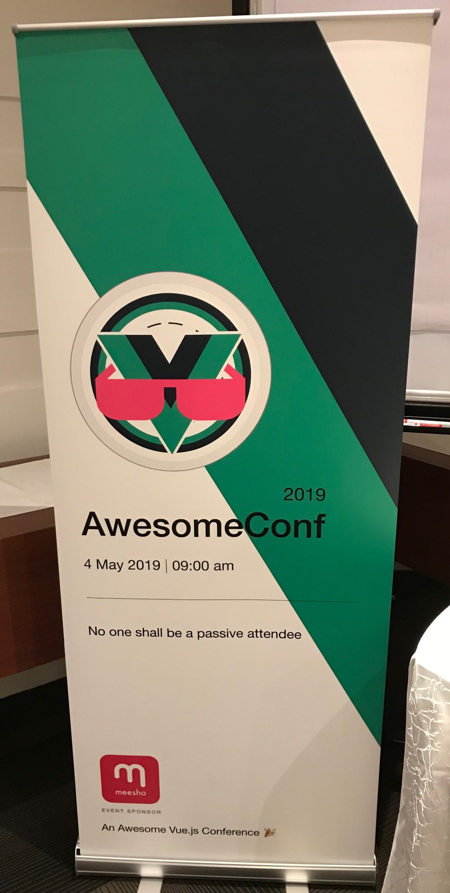
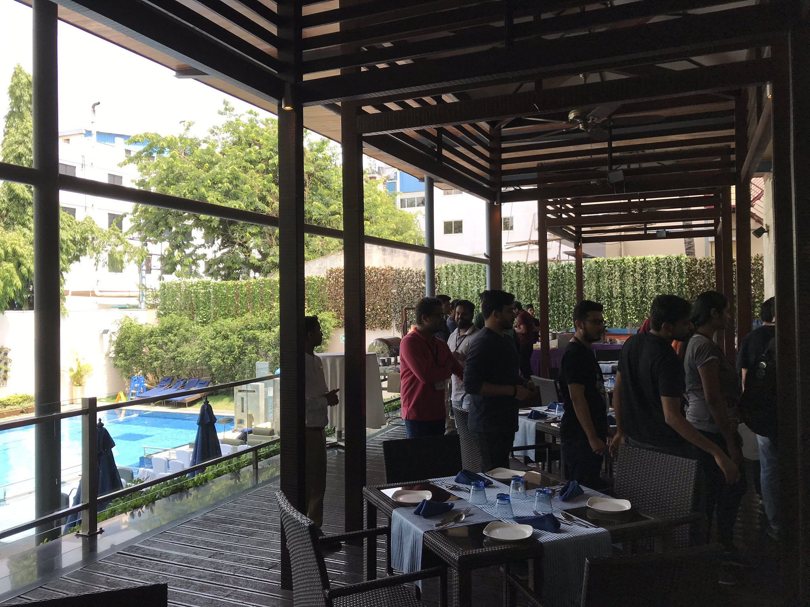
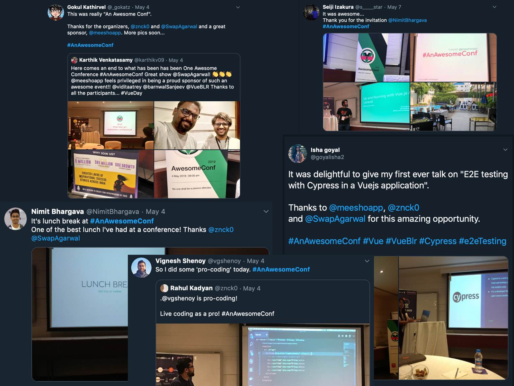
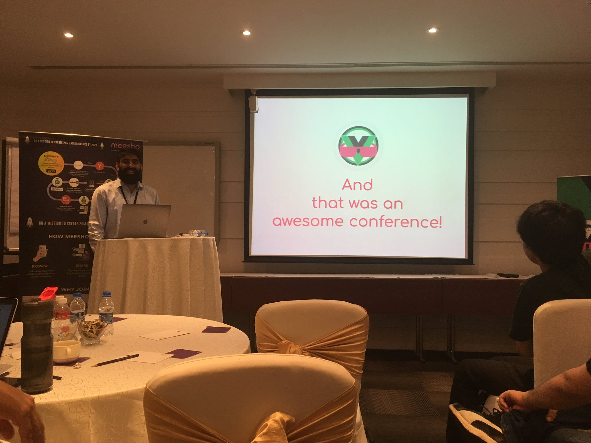
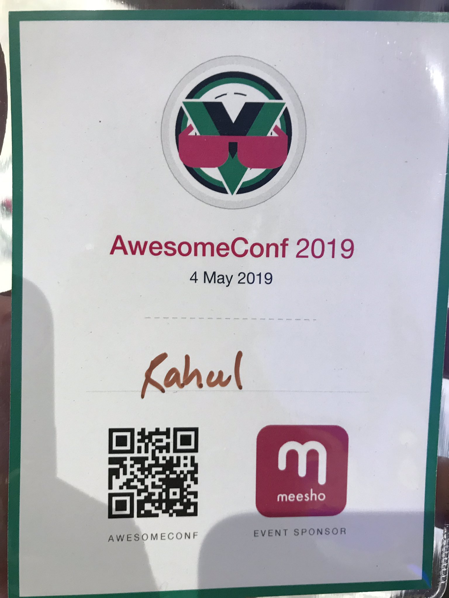

# Running an awesome conference

I love attending conferences. For inspiring talks, for making new friends and meeting old friends, or for learning new things, conferences have been influential in my journey as a developer.  I like many conferences, but I want to be in every vue conference. If you been to a vue Conference, then you know that there’s something different about it. The environment is so welcoming and friendly. Sad! I have to travel across the world to be in one. I have longed to see a vue conference in India, my home, for a long time now.

<!-- more -->

I decided, I was done waiting! _Let’s start a vue conference_, I urged Swapnil. He was in. We were ready. But we didn’t have the slightest clue how to. So, we started looking at other conferences. ReactFoo, JSFoo, VueConf, Connect.Tech and VueFes. These conferences are enormous. A lot goes into running them, and that scared me. It was not doable for me, for Swapnil, for a team of two who has been struggling to keep the vue meetup running.

The dream would have ended there if Sid wasn’t there.

One evening, Sid dropped something in my Twitter inbox:

> Hi! I have a CFP for you. 😅

That random CFP has been very phenomenal for me. Who knew one random message, on the evening of 23rd December 2018, would make a conference organizer one day. Thanks a lot, Sid for the birthday gift!

> Hi 👋
>
> This is random but I'm organizing a tiny react conference on Jan 5
>
> very few attendees compared to a normal conf (25) and plenty of time between talks to discuss and have conversations
>
> I realize that's the part I most enjoy at conferences, so it would be cool to shape the entire conference around it
>
> would you like to give a talk on vue features that the react community should steal 😁
>
> [https://tinyconf.in](https://tinyconf.in) (not announced yet)

It was a different kind of CFP — “here’s a topic, you’re speaking on it.” If you know me, you know that I love taking vue to react conferences. I was in.

[TinyConf](https://tinyconf.in) was excellent, I had a great time. I got a valuable lesson out of it: conferences can be small.

A small conference! A hope! A possibility!

<!-- Planning -->

The dream was back on! We decided to have a small conference, 30 people. Next, we needed speakers, a catchy name, and a venue. Everything we’re already doing for meetups but this time for the conference.

We started with the name to get the domain. Don’t we all like to buy a domain the moment idea strikes!

The first choice was: **EliteConf** - best vue developers at one place.

The name didn’t paint the picture of inclusiveness and warmth of a vue conference. Next set of choices were:

OpenConf, FocusConf, AllConf, VuetifulConf, VueUnconf

Nah! None of these.

What about **CoreConf**?

But we don’t have all core members speaking.

**MiniConf**?

Very close to Sid’s tinyconf, it has been our inspiration but sounds like a ripoff.

**SuperConf**?

Nah! We want first-time speakers, it’s not very inviting. Maybe **DebutConf**?

Maybe! It can be a meetup theme, though.

**AwesomeConf**?

+1

Nothing against AwesomeConf. Even if I had something, it would have been impossible to convince Swapnil otherwise. That guy is crazy for awesome lists!

Got a name! Lucky us, google came up with .dev TLD around then. But we had to wait for the public release. And hope nobody awesomeconf.dev during pre-release days. The days were hard, and the nights were long. Finally, we got it - [awesomeconf.dev](https://awesomeconf.dev)

 <iframe border=0 frameborder=0 height=216 width=360 src="https://twitframe.com/show?url=https://twitter.com/VueBLR/status/1101209663834533888"></iframe>

Next immediate step, build a website. We needed a theme, an identity for the conference. A theme which represents the part we enjoy most: conversations. If you’re a speaker, it’s easier to start a conversation as people already know what you're working on.  We decided, let's make everyone speak!

And we got a unique conference:

- 30 attendees
- Everyone speaks!
- All about vue

<!-- Executing -->

Swapnil immediately put out a website and CFP for the AwesomeConf.

 <iframe border=0 frameborder=0 height=680 width=360 src="https://twitframe.com/show?url=https://twitter.com/VueBLR/status/1102617517292322816"></iframe>

Next step was to find a venue. We had the regular meetup venue as a backup. But we wanted better, something like a hotel conference room! So, we started looking for sponsors.

What do we have for sponsors?

- 30 vue developers
- One room
- Growing frontend ecosystem
- Networking opportunity

It was unconventional, far from regular conferences. We reached out to a few companies. Swapnil could lock-in a deal with [Meesho](https://meesho.com), and we got a fantastic hotel venue.

We were targeting to have 30 people and had all arrangements. But, we didn’t realize it would be impossible to have 30 sessions. In fact, we could not accommodate more than 15 talks.

We decided to go with 15 talks. For other 15 available seats, we decided to allow +1 with every speaker.

> Hello everyone! 👋
>
> Speaking at a conference can be stressful and intimidating. A familiar face can be very comforting and confidence boosting. We encourage you to ask your significant other or your friend or your colleague to join AwesomeConf for a day with Vue.
>
> If you plan to bring +1 to the conference, please confirm by replying to this thread.

A day before the conference. We double checked the venue, perfected the schedule. Everything was perfect. Well, except the one most important thing:

 <iframe border=0 frameborder=0 height=264 width=360 src="https://twitframe.com/show?url=https://twitter.com/znck0/status/1124453377792864257"></iframe>

I self-appointed myself, the master of ceremonies. A good MC must throw in bad puns. Chris and Ben shared their most prized collection of vue puns. Now, I was ready. I was hosting a conference. I was a **conference organizer**.

<!-- The D-day -->

{large}

The conference day, we were excited, terrified, nervous, and every other thing. All attendees were there on time, which had rarely happened in our meetups. But there’s always someone who’s stuck in Bangalore traffic, but this one was our first speaker. It’s a different story, you should read [the article](https://dev.to/gokatz/first-time-speaker-fts-with-few-tips-45po) by Gokul.

_**Enjoy the Vue**_ - Swapnil completed his welcome address and the conference begins. We had 5 sessions of 3 talks each, filled with breaks for discussions and a great lunch. Some people enjoyed talks, others enjoyed conversations but most enjoyed the lunch.

{large}

<!-- What went well? -->

## Did we meet our expectations?

15 talks, 8 first time speakers, 1 student. We did an excellent job with the first vue conference in India, and it seems likewise from the twitter reactions.

{large}

I wanted to host a vue conference where every attendee is actively involved, and we did it. I am pleased with AwesomeConf, and so are the attendees. Also, no one was hurt by my bad jokes and puns, so that's a plus.

 <iframe border=0 frameborder=0 height=480 width=360 src="https://twitframe.com/show?url=https://twitter.com/SwapAgarwal/status/1124556436711849985"></iframe>

<!-- What didn't work? -->
## What didn't work?

**The projector**. We had some issues with the projector throughout the day. Working with projectors is terrible. Daisy chaining dongles to get the correct port. Checking loose connections. Changing laptops after every talk. It was too much work. We should have tested it a day before. Also, a multi-input projector would have been much better.

**Recording**. We did try to record the conference. Our lack of experience with professional recording setup resulted in terrible videos. The talks were excellent, and they deserve to be shared with the world. We will plan better next time.

## It was an awesome conference!

I feel the conference provided the required platform to bring out those eight first-time speakers.

_You are a conference speaker now!_  
_You are awesome._  
_You spoke at an awesome conference._  
_Which conference?_ – I ended my closing address.  
_An awesome conference_.

<!-- Thanks & Mentions -->

Thanks a lot for being part of the AwesomeConf.

Thanks [Sid](https://twitter.com/@siddharthkp) for inspiring us and introducing to the idea of [a tiny conference](https://sid.studio/post/tinyconf).
Thanks [Zainab](https://twitter.com/@zainabbawa) for helping and mentoring us.
Thanks [Suwardhan](https://instagram.com/suwardhan.design) for all the graphics and design work.
Thanks [Meesho](https://twitter.com/@MeeshoApp) for supporting us.

[Swap](https://twitter.com/@SwapAgarwal) & [Znck](https://twitter.com/@znck0) would be back soon with next iteration of AwesomeConf.

{small}
