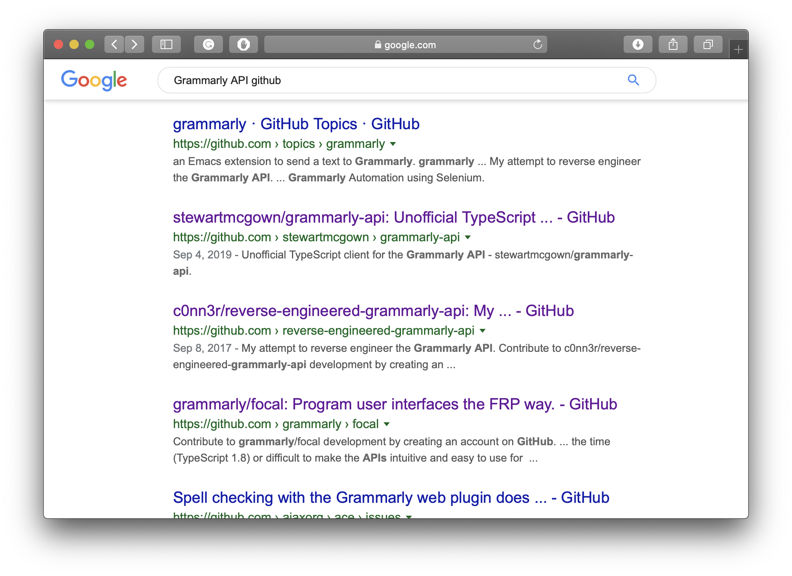
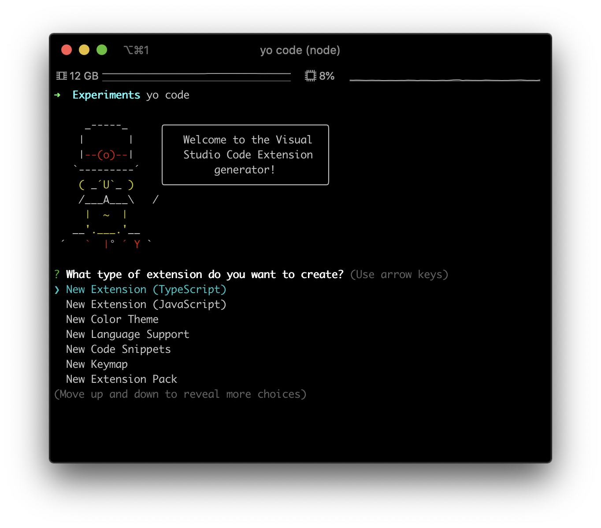
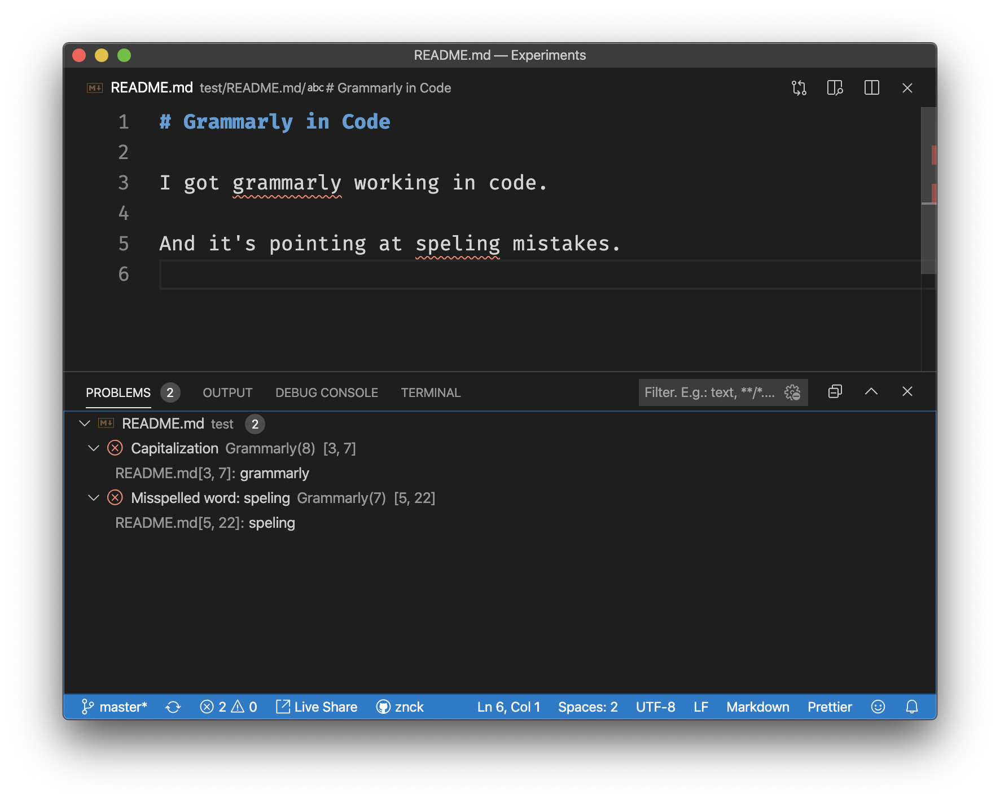

# Grammarly in Code

There's no simpler writing tool than markdown. There's no elegant editor than [code](https://code.visualstudio.com). There's no better writing environment than markdown in <span title="VS Code">code</span>. It's perfect, but whenever I write, I find myself copy-pasting back and forth between Grammarly editor and VS Code editor. Grammarly makes my writing much better, but it also forces me to use their editor. Don't take me wrong I don't hate their editor, in fact, I kind of like it — bright, clean, spacious. But it's not sufficient for me as my articles generally have images, code snippets, figures, and sometimes markup. And the lack of markdown syntax highlight is absolutely a deal-breaker. If Grammarly worked in VS Code editor, wouldn't that be perfect?

<!-- more -->

I searched the code marketplace for a Grammarly extension, but there wasn't one. So, I continued jumping between Grammarly and Code, waiting for someone to remedy my pain. A year passed, but nobody came up with a solution. I couldn't bear it anymore, I had to help me; I had to build the integration myself. And, the journey of getting Grammarly in Code began.

## Hunt for Grammarly API

"Grammarly API", I entered in the Google white box and hit enter; the results disappointed me.

<Tweet id="388621218586578944">No API--yet! We'll keep you posted! — @Grammarly</Tweet>

No API -- yet! It's been six years since they first acknowledged that they don't have a public API.

"Grammarly API github", I hit Google again.



I found something — a reverse engineered [Grammarly client](https://github.com/stewartmcgown/grammarly-api). This was good, I decided to base my extension on this library.

## VS Code Extension 101

VS Code has [yeoman](https://yeoman.io) generator, so all we need to get started is to run the command `yo code`.



I picked the very first option; "New Extension (TypeScript)" and I got a great starting point. Next, I needed to create a small language server to analyse text content with Grammarly API and post grammar diagnostics. Code's [Language Server Extension Guide](https://code.visualstudio.com/api/language-extensions/language-server-extension-guide) was very helpful.

```ts
import { createConnection, TextDocuments } from 'vscode-languageserver'
import { Grammarly } from '@stewartmcgown/grammarly-api'

// Create a connection for the server.
const connection = createConnection()

// Create a simple text document manager.
const documents: TextDocuments = new TextDocuments()

connection.onInitialize(() => ({
  capabilities: {
    textDocumentSync: documents.syncKind,
  },
}))

documents.onDidOpen(async ({ document }) => {
  const results = await new Grammarly().analyze(document.getText())

  const diagnostics = results.alerts.map(() => {
    /*
    convert results to Code diagnostics.
    ...
    */
  })

  // Send diagnostics
  connection.sendDiagnostics({
    uri: document.uri,
    diagnostics,
  })
})
```

I got it working.



<!--
  Overview:

  - Grammarly API discovery
  -
-->

> Markdown. Code. Grammarly.
