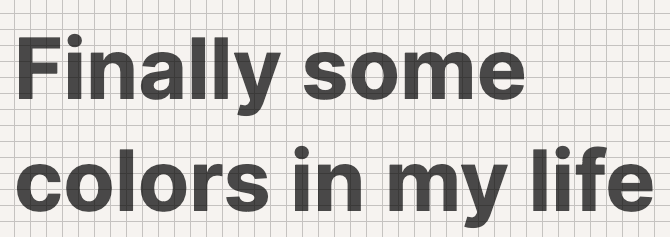
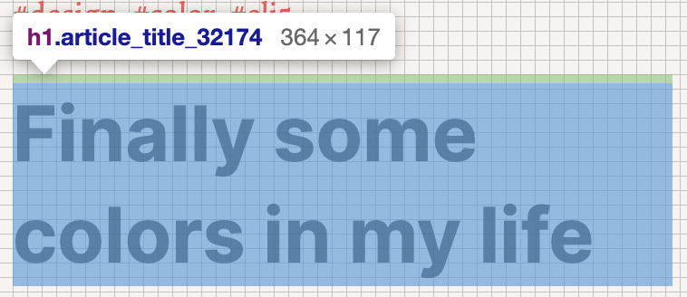
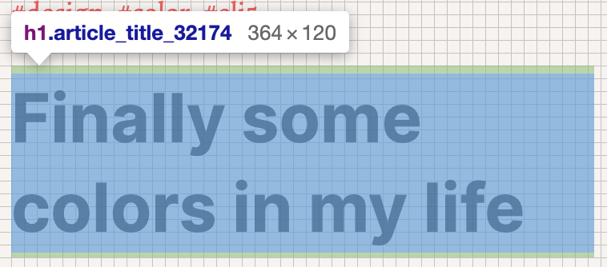

# Simple Hard Things

Simple things are easy; everyone says so. However, in reality, it may not be so.

<!-- more -->

Have you ever met someone who likes complicated things? Well, I haven't! I'm pretty sure; everyone wants simple. We create simple interfaces, write simple, and ship simple products. I like simple things, as they are easy for most of us, in most situations. However, simple is not guaranteed to be easy.

I want to share a simple hard thing, but before that tell me, "do you like the design of this blog?". I know at least one person likes it as Egoist says, "Your blog looks clean."

<div style="display: flex; align-items: center; justify-content: center;" role="presentation">
 <iframe border=0 frameborder=0 height=480 width=360 src="https://twitframe.com/show?url=https://twitter.com/_egoistlily/status/1132564698677690368" aria-hidden="true" />
</div>

Clean or say it looks simple.

Ask me, was it simple building it?

The core idea here is simple and straightforward. I wanted to create a website with a grid in the background. All the contents i.e., text, paragraphs, headings, images, code snippets, etc. should align with the background grid.

However, the implementation of this simple idea is quite hard. I started with the background. I need a repeating grid pattern for the background image, so I prayed the [SVG goddess](https://twitter.com/sarah_edo), and she blessed me with knowledge to write following snippet:

<figure data-type="code">

```xml
<svg width="100%" height="100%"
  xmlns="http://www.w3.org/2000/svg">
  <defs>
    <pattern id="grid" width="4" height="4" patternUnits="userSpaceOnUse">
      <path d="M 4 0 L 0 0 0 4" fill="none" stroke="rgba(255, 255, 255, 0.02)" stroke-width="0.5"/>
    </pattern>
  </defs>

  <rect width="100%" height="100%" fill="url(#grid)" />
</svg>
```

<figcaption>

SVG image used to draw background grid pattern.

</figcaption>

</figure>

Next, I have to put some text on the page, and since everything should align with the grid, I'm restricted to use sizes and heights which are multiple of eight.

I set the base `font-size` of the page to `16px` and use relative units for sizes and heights.

[Suwardhan](https://suwardhan.com) has crunched an elegant type system for me, "The title of should use a 42px font.". However, 42 is not a multiple of eight. It doesn't align with my background grid, and I don't want to mess up with his design. What should I do?

I can use line-height to fit the height constraint. A line-height of `3.5rem` or `56px` works well here. If the title spans over two lines, then the height of the title block would be two times the line-height (i.e. `112px`).

However, the height of the title block does not ensure that the baseline of the text lies on the grid.



I use top padding of 5px to align the text baseline, and since the line-height is multiple of eight, all lines of text magically align with the background grid.



However, the height of the title block is `117px` which breaks the height constraint and if one element breaks the constraint the effect cascades. I use the smallest bottom padding to make the height a multiple of eight. Here, it would be 3px (117px + 3px = 120px). The bottom padding complements top padding to become a multiple of eight i.e. 5px + 3px = 8px.



I got a pattern here: every text block would have a line-height which is multiple of eight, then top padding (which would always be less than 8px) to align text baseline and finally a complementing bottom padding.

So I apply this pattern to all the text elements. Other elements like images and code snippets needed similar fine adjustments, and finally, I had a page with complete text and background alignment.

"Noto Serif looks better than Helvetica, replace the primary font." - Suwardhan

🤦‍♂️ The two fonts have different baseline heights, so I have to adjust the top-paddings again. Readjusting text in dozens of places is a daunting task, and it would be even harder in the future. I decide to bring in <span title="A topic for some other day!">atomic design pattern and use [accoutrement](https://www.oddbird.net/accoutrement/) for token management</span>. So, all my adjustments are in one file:

<figure data-type="code">

```scss
$sizes: (
  'unit': 8px,

  'base': '#unit' ('times': 2),

  'root': '#base', // Used to calculate rem from px.

  'line-height-base': '#base' ('times': 1.5),

  'font-size-ui': '#base' ('times': 0.75, 'convert-units': 'rem'),
  'line-height-ui': '#base' ('times': 1, 'convert-units': 'rem'),
  'vh-adjust-ui': '#unit' ('times': 4/8),
  
  'font-size-h1': '#base' ('times': 2.625, 'convert-units': 'rem'),
  'line-height-h1': '#base' ('times': 3.5, 'convert-units': 'rem'),
  'vh-adjust-h1': '#unit' ('times': 5/8),
  
  // ...
);
```

<figcaption>

Typesetting for znck.dev ([source](https://github.com/znck/znck.dev))

</figcaption>

</figure>

It is hard to implement this simple idea for me so the simple hard thing.

_It is hard to provide the simple._

Whenever you feel, it is simple, and I can easily get it. **Thank the creator**; she has done the hard work.
